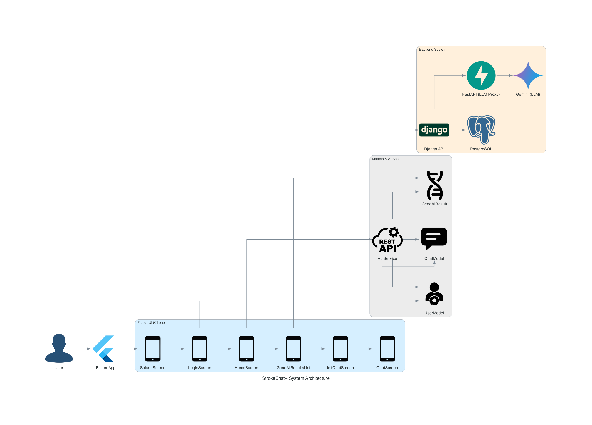

# StrokeChat+

AI 기반 유전자 분석 + 챗봇 기반 환자 커뮤니케이션 시스템

---

## 개요

StrokeChat+는 뇌졸중 환자의 유전자 분석 결과를 Flutter 기반 모바일 앱에서 확인하고,  
AI 챗봇과의 대화를 통해 보다 쉬운 설명과 후속 질의응답을 가능하게 하는 **의료 특화 커뮤니케이션 플랫폼**입니다.

- 유전자 분석 결과([GENE_DL 리포지토리](https://github.com/MANDUnoko/GENE_DL)) 요약
- Gemini 기반 챗봇과 대화
- 환자 맞춤형 설명 자동 생성
- 보안 토큰 기반 로그인 (JWT)
- Django / FastAPI / PostgreSQL 백엔드 연동

---

## 시스템 구성

- **Frontend**
  - Flutter (Andriod Pixel 8 기반 작업)
  - UI 구조: Splash → Login → Home → 결과 리스트 → 챗봇
  - 사용자 경험 개선을 위한 Apple/Toss 감성 디자인

- **Backend**
  - Django: 사용자 인증, 유전자 결과 API
  - FastAPI: Gemini 호출 프록시 서버
  - PostgreSQL: 유전자 분석 결과 및 대화 저장

- **AI 서비스**
  - 유전자 분석 결과 기반 자동 요약
  - Gemini 기반 질의응답 및 설명



---

## 프로젝트 구조

```
strokechat_app/
│
├── assets/ # 이미지, 폰트 등 앱 리소스
├── lib/ # 주요 Dart 코드 (UI, 모델, 서비스 등)
│ ├── models/ # 데이터 모델 정의
│ ├── screens/ # 화면 구성 (로그인, 홈, 결과, 챗봇 등)
│ ├── services/ # API 연동 모듈
│ ├── constants/ # 앱 전역 상수 및 키
│ └── widgets/ # 공용 위젯
│
├── pubspec.yaml # 의존성 및 에셋 설정
├── .gitignore # 불필요한 파일 제외 설정
└── README.md # 프로젝트 설명 문서
```

---

## 실행 방법

```bash
# 의존성 설치
flutter pub get

# 앱 실행
flutter run
